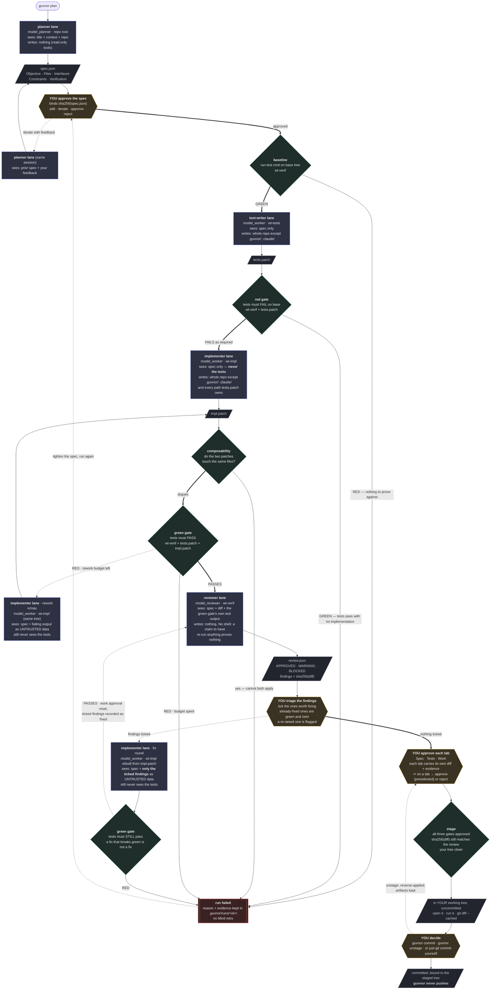

# guvnor

Spec-gated feature orchestrator: LLM lanes type, evidence decides, humans hold
the gates.

## Getting started

You need a git repo with a working test command, and the `claude` CLI on your
PATH.

```
guvnor           no args: opens the TUI
```

The TUI walks the whole loop below with the keyboard. The same loop is also a
set of CLI verbs for scripts: `plan`, `run`, `review`, `approve`/`reject`,
`stage`, `commit`/`unstage`. `guvnor --help` lists them all.

## The loop

```
guvnor plan "feature"            planner drafts a five-part spec
        │                        (Objective/Files/Interfaces/Constraints/Verification)
   you iterate (optional)        feedback → planner redrafts, same session →
        │                        repeat as needed; nothing downstream exists yet
   you approve the spec          approval bound to sha256(spec.json)
        │
guvnor run <id>
   [0] baseline                  test cmd must be GREEN on base (else red proves nothing)
   [1] test-writer lane          sees the SPEC ONLY
   [2] red gate                  tests must FAIL on base; failure reason recorded
   [3] implementer lane          sees the SPEC ONLY · never sees the tests
   [4] green gate                tests must PASS with the implementation
   [5] reviewer lane             spec + diff + the green gate's own output · verdict bound to sha256(diff)
        │
   you triage the findings       tick what to fix → fix lane → green re-check →
        │                        re-review. Findings already fixed stay green
        │                        and inert; a re-raised one is marked as such.
   you approve each tab          Spec · Tests · Work — ↵ on the tab you just read
        │
guvnor stage <id>                applies it to YOUR working tree and stops
        │                        so you can open the files and run the thing
   you look at it                git diff --cached · run it · change your mind
        │
guvnor commit <id> -m "..."      writes the commit, bound to what's staged
guvnor unstage <id>              or takes it back out; the artifacts stay either way
```

Guvnor never pushes. Its commit is bound to the staged tree: edit the staging
area yourself and it refuses to sign it, because what it signs is what a
reviewer read.

## Flow



**Legend** — `▭` LLM lane (model seat · worktree · what it can see and write) ·
`◇` deterministic gate (guvnor decides, no model involved) · `⬡` human gate ·
`▱` artifact on disk. Bold arrows are the happy path; dotted arrows are loops.

Each lane is a throwaway `git worktree` under `.guvnor/wt/`, running a headless
`claude -p` with its own hook-enforced write fence. Every run leaves its full
evidence trail in `.guvnor/runs/<id>/`.

One sample per role, run sequentially — there is no best-of-N. The
cross-checking comes from splitting *roles* (the test-writer and the
implementer never see each other's work) and from the tier split
(`model_reviewer` above `model_worker`), not from racing candidates. The fix
round and the rework loop are the same lane trying again with evidence, never
a contest between parallel attempts.

## Where the design comes from

Guvnor's rules come from watching a related project break, not from theory.
[`CharlesHoskinson/foreman`](https://github.com/CharlesHoskinson/foreman) runs
a similar loop across several model vendors, and it keeps a public log of
every time that loop lied to itself: over a hundred dated incident entries, a
long list of standing traps, and several formal-verification reports that
model-checked its own gate logic and found holes in the shipped design.
Guvnor's doctrine is downstream of reading that log closely.

Guvnor's first rule, "reports are claims, not proof," is foreman's own phrase
almost verbatim, and it was earned the hard way. One entry logs three lanes
that each reported success with a clean exit code while the real diff added
zero commits; the change-detector had been satisfied by a placeholder file
the lane was told to write for exactly that purpose. Another logs a worker
whose own summary called its implementation "landed and independently
verified," while the tree still held a literal sabotage string that could
never match, left over from a "destructive proof" nobody had reverted.
Guvnor's version of the same lesson is structural rather than a reminder in a
doc: "done" binds to a content hash of the captured patch plus a real exit
code, and nothing a lane says about its own work counts as evidence of
anything.

Foreman also names checker soundness directly: a check has to be shown
failing against a known-bad input before it's trusted, with mutation testing
(revert the fix, confirm the test breaks) as the concrete technique. Guvnor's
red gate is that rule turned into code instead of a guideline. Tests that
already pass on the unmodified tree are rejected outright, before any
implementation exists that could make them pass for the wrong reason.

Decorrelation, guvnor took and then had to change. Foreman decorrelates
worker from auditor by running them on different model vendors, and its own
research is candid that this buys less than it looks like: nine frontier
models across seven vendors behave like roughly two independent votes.
Guvnor is Claude-only, so a vendor split isn't available at all. It
decorrelates by role instead: the test-writer never sees the implementation,
the implementer never sees the tests, and the one split available inside a
single vendor, a stronger model reviewing a cheaper one's work, stands in for
the vendor split foreman leans on.

The same audit trail caught a hole in foreman's own shipped gate, formally: a
stale `APPROVED` verdict could still authorize merging a diff that had
changed since the verdict was written, because the check compared an enum
against "not BLOCKED" rather than checking the verdict was for that diff.
Guvnor's `commit` and `stage` refuse unless the patches on disk still hash to
the reviewer's own recorded digest. That binding is exactly what was missing.

One place guvnor made the same mistake foreman's bug log calls out,
independently, and fixed it the same way: an early digest hashed
`git status --porcelain`, which foreman's own postmortem calls "structurally
blind" to a content edit inside a file that was already dirty. Guvnor's test
suite caught the identical failure, a real edit reading as a silent no-op,
and the fix was the one foreman's log recommends: hash the content, not the
status line.

And guvnor's flattest disagreement: foreman's own incident log records its
orchestrating process pushing straight to `main` under time pressure,
skipping its own merge gate to do it. Guvnor treats that as the one line
that doesn't move. It writes the commit when asked. It does not push, on any
path, and that isn't a setting.

Not everything here is a correction. Worktree-per-lane isolation, foreman had
first, and guvnor kept it outright: each lane runs in a throwaway git
worktree, and a run's evidence survives even when the run fails.
